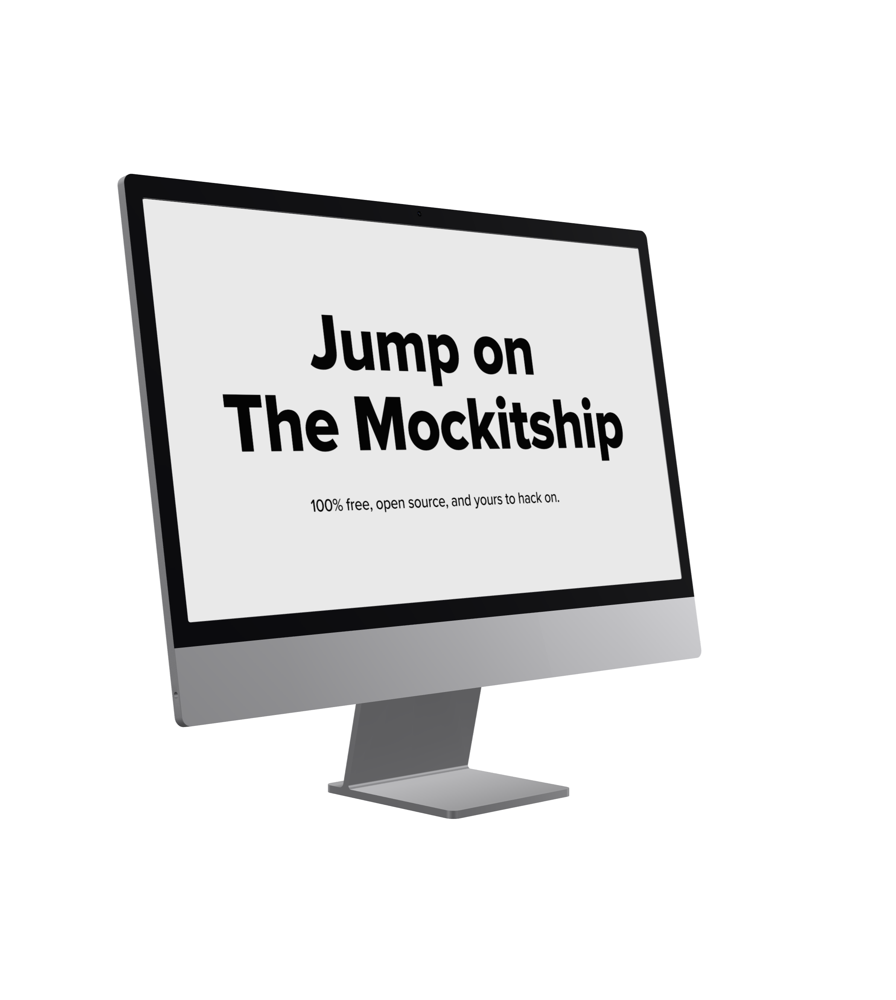

# Device Mockup Kit
https://mockitship.com



## "You can just paste with the keyboard onto the canvas. Baller." - Jeff Schmetsky, Mockstar

**Create stunning device mockups in seconds.** Drop in your designs, download pixel-perfect PNGs. No accounts, no watermarks, no BS.

## Why This Exists

Tired of bloated mockup tools that require subscriptions, watermark your work, or limit exports? This app is **100% free, open source, and yours to hack on.** Fork it, customize it, add your own devices, or integrate it into your workflow. Built with vanilla JavaScript and modern web APIs—no frameworks to wrestle with.

**Perfect for:**
- 🎨 Designers showcasing UI work
- 📱 Product teams creating marketing materials
- 🛠️ Developers building custom mockup generators
- 🎓 Students learning 3D web graphics
- 🚀 Anyone who needs quick, professional mockups

A web application for creating professional device mockups with 2D canvas rendering and 3D model viewer support. 

## Features

- 📱 Multiple device support (iPhone, iPad, iMac)
- 🎨 Drag & drop image upload
- 🔄 2D and 3D view modes
- 🎯 Pixel-perfect mockup generation
- 💾 PNG export
- 🎭 Customizable device colors and materials
- ⌨️ Paste support for quick workflows

## Project Structure

```
mocker/
├── index.html              # Main HTML file
├── README.md              # This file
├── css/                   # Stylesheets
│   ├── README.md         # CSS documentation
│   ├── base.css          # Foundation styles
│   ├── layout.css        # Layout and responsive design
│   └── components.css    # UI components
├── js/                    # JavaScript modules
│   ├── README.md         # JavaScript documentation
│   ├── devices.js        # Device configuration library
│   ├── materials.js      # Material management
│   ├── textures.js       # Texture handling
│   ├── canvas.js         # 2D rendering
│   └── app.js           # Main application
└── devices/              # Device assets
    ├── iPhone 17 Pro/
    ├── iPad/
    └── iMac/
```

## Quick Start

1. **Open the application:**
   ```bash
   open index.html
   ```

2. **Select a device** from the dropdown

3. **Upload an image** by:
   - Clicking "Upload image"
   - Dragging and dropping
   - Pasting (Cmd/Ctrl + V)

4. **Toggle view mode** (2D/3D) if available

5. **Download** your mockup as PNG

## Adding a New Device

### Required Assets

**For 2D Support:**
- `{device-name}_bg.png` - Device background with transparent screen
- `{device-name}_screenmask.png` - White mask defining screen area

**For 3D Support:**
- `{device-name}.glb` - 3D model file

### Configuration

1. Create device folder in `devices/`
2. Add assets to the folder
3. Edit `js/devices.js` and add to `DEVICE_LIBRARY`:

```javascript
{
  id: "device-id",
  name: "Device Name",
  folder: "devices/DeviceFolder",
  assetPrefix: "device-name",
  screenWidth: 1920,
  screenHeight: 1080,
  has2DAssets: true, // false if 3D-only
  modelPath: "devices/DeviceFolder/model.glb", // optional
  bodyMaterials: [
    {
      name: "MaterialName", // From GLB file
      color: [0.5, 0.5, 0.5, 1], // RGBA (0-1)
      metallicFactor: 0.5,
      roughnessFactor: 0.5,
    }
  ]
}
```

4. Refresh the page - your device will appear in the dropdown!

## Material Configuration

### Finding Material Names

1. Open browser console (F12)
2. Select your device
3. Switch to 3D view
4. Look for "Available materials in model" log
5. Use those exact names in `bodyMaterials`

### Color Format

Colors use normalized RGB: `[r, g, b, a]` where values are 0-1

**Examples:**
- Black: `[0, 0, 0, 1]`
- White: `[1, 1, 1, 1]`
- Space Grey: `[0.22, 0.22, 0.23, 1]`
- Silver: `[0.85, 0.85, 0.86, 1]`

**Convert from Hex:**
```
#4d567d → RGB(77, 86, 125)
       → [77/255, 86/255, 125/255, 1]
       → [0.302, 0.337, 0.490, 1]
```

### Material Properties

- **metallicFactor** (0-1): How metallic the surface appears
  - 0 = Non-metallic (plastic, rubber)
  - 1 = Fully metallic (polished metal)

- **roughnessFactor** (0-1): Surface smoothness
  - 0 = Mirror-smooth (glossy)
  - 1 = Very rough (matte)

## Development

### File Organization

- **HTML**: `index.html` (minimal, just structure)
- **CSS**: Modular in `css/` folder (base, layout, components)
- **JavaScript**: ES6 modules in `js/` folder
- **Assets**: Device files in `devices/` folder

### Debugging

**Check Console for:**
- "Available materials in model" - Lists all GLB materials
- "Applying tint to material X" - Confirms material found
- "Material X not found" - Material name mismatch
- "Found screen material: X" - Screen detection

**Common Issues:**
- Material not found → Check exact spelling/case in GLB
- Screen not updating → Check screenMaterialName matches
- Colors wrong → Verify RGB values are 0-1, not 0-255

## Browser Requirements

- Modern browser with ES6 module support
- Chrome 90+, Firefox 88+, Safari 14+, Edge 90+

## Technologies

- **3D Viewer**: [Google Model Viewer](https://modelviewer.dev/)
- **2D Rendering**: HTML5 Canvas API
- **Styling**: Modern CSS (Grid, Flexbox, Custom Properties)
- **JavaScript**: ES6 Modules, async/await


## License
This project is released under the [MIT License](LICENSE).  
You are free to use, modify, and distribute it for any purpose.

## Credits
"Iphone 17 pro" (https://skfb.ly/pzYOR) by Ibrahim.Bhl is licensed under Creative Commons Attribution (http://creativecommons.org/licenses/by/4.0/).

"macbook pro M3 16 inch 2024" (https://skfb.ly/oQJZu) by jackbaeten is licensed under Creative Commons Attribution (http://creativecommons.org/licenses/by/4.0/).

"iMac 2021" (https://skfb.ly/o6poS) by DatSketch is licensed under Creative Commons Attribution (http://creativecommons.org/licenses/by/4.0/).